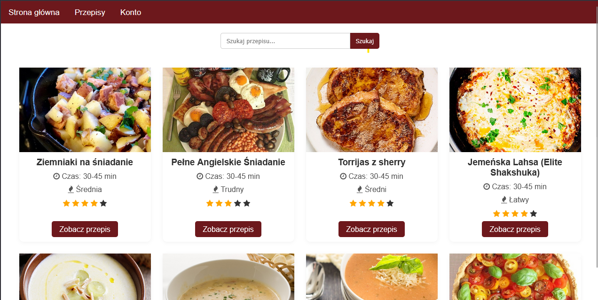

# Aplikacja webowa flask

## System webowy umożliwiający prowadzenie bloga z przepisami oraz udostępniający możliwość interkacji użytkowników z danymi przepisami (oceny, komentarze)

## Hosting
Strona dostępna jest pod adresem: https://zarlwok.pl/
Jej włączenie może chwilę zająć - podczas dłuższego braku ruchu jest usypiana.
Hosting zrealizowano korzystająć z Render dla bazy danych oraz kontenera z backendem oraz Cloudinary to zasobów mulitmedialnych.

## Stack technologiczny
W skład aplikacji na chwilę obecną wchodzi:
- **Backend:** Python, Flask, Flask-Login, Flask-SQLAlchemy - hostowany na Render  
- **Frontend:** HTML, CSS, JavaScript, szablony Jinja2  
- **Baza danych:** PostgreSQL - hostowana na Render, oraz zdjęcia przepisów na Cloudinary
- **DevOps:** Docker, Docker Compose, CI Workflow do automatycznej weryfikacji buildów 

## Kluczowe funkcjonalności
Aplikacja na chwilę obecną umożliwia:
- dodawanie przepisów
- administracje zawartością strony poprzez panel administratora
- logowanie i uwierzytelnianie z użyciem **Flask-Login**

## Źródło danych
Przepisy, instrukcje i zdjęcia pochodzą z API **[TheMealDB](https://www.themealdb.com)**.

Na potrzeby projektu dane zmodyfikowano - przepisy przetłumaczono na język polski, metadane przepisu takie jak czas przygotowania, liczba porcji i trudność zostałą dodana arbitralnie.

## GUI
Warstwa graficzna systemu opiera się na prostych stylach CSS. Zaimplementowano responsywność.
Strona jest zabezpieczona przed typowymi atakami, np. SQL Injection, jednak tymczasowo wyłączono możliwość tworzenia konta w celu
uniknięcia przetwarzania danych osobowych.

## Do dodania
Aplikacja wymaga dodania walidacji treści wrzucanych przez użytkowników.
Docelowo planowany jest pełny deploy z użyciem CI/CD. 
